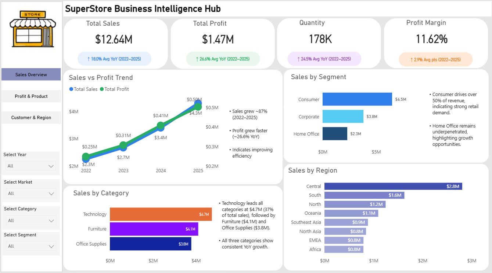
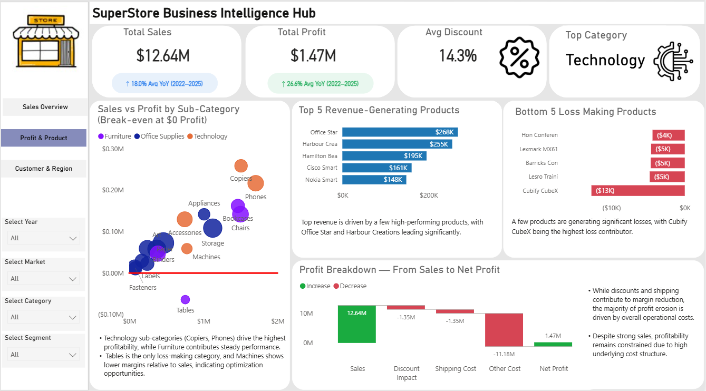
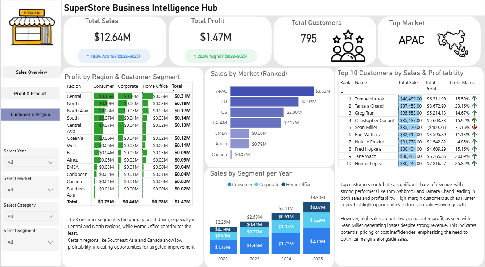

# 🏪 SuperStore Business Intelligence Hub
### An End-to-End Power BI Dashboard Project


---

## 📌 Project Overview

The **SuperStore Business Intelligence Hub** is a 3-page interactive Power BI dashboard built on the Global SuperStore dataset. The project analyses **51,290 orders** across **7 global markets**, **13 regions**, **3 product categories**, and **795 customers** spanning **4 years (2022–2025)**.

The goal was to transform raw transactional data into actionable business insights through professional dashboard design, advanced DAX measures, and data storytelling — exactly how a real business analyst would present findings to stakeholders.

---

## 🖼️ Dashboard Screenshots

### Page 1 — Executive Sales Overview
> High-level KPIs, sales trends, category performance, and geographic distribution



### Page 2 — Profit & Product Analysis
> Sub-category profitability, top/bottom performing products, and profit breakdown
 


### Page 3 — Customer & Regional Intelligence
> Market performance, customer segmentation, and top customer profitability



---

## 📊 Dataset

| Property | Details |
|---|---|
| **Source** | Kaggle — Global SuperStore Dataset |
| **Total Records** | 51,290 orders |
| **Time Period** | 2011 – 2014 |
| **Markets** | 7 (APAC, EU, US, LATAM, EMEA, Africa, Canada) |
| **Regions** | 13 |
| **Categories** | 3 (Technology, Furniture, Office Supplies) |
| **Sub-Categories** | 17 |
| **Customers** | 795 unique |
| **Columns** | 21 |

---

## 🔍 Key Insights Discovered

### 💰 Sales & Profitability
- Total Sales grew **87%** from **$2.3M (2011) to $4.3M (2014)** — consistent YoY growth across all 4 years
- Profit grew even faster at **26.6% avg YoY** — indicating improving operational efficiency
- Overall **Profit Margin = 11.62%** — healthy but with room for improvement

### 📦 Product Performance
- **Technology** leads all categories at **$4.7M (37% of total sales)** with the highest profit margins
- **Tables sub-category** is the critical finding — generates **$1M+ in revenue but operates at a LOSS** — driven by excessive discounting
- **Copiers and Phones** are the star performers — highest sales AND highest profit simultaneously
- Top product: **Cisco Smart Phone** at $160.8K revenue

### 🌍 Regional & Market Performance
- **APAC leads globally at $3.58M** — 5× higher than Canada ($0.07M)
- **Central region** is the most profitable within the US market at $0.31M
- **Southeast Asia and Canada** show consistently low profitability — opportunity for targeted strategy

### 👥 Customer Intelligence
- **Consumer segment** drives 51.48% of total revenue — strongest retail demand
- **Tom Ashbrook** is the #1 customer at $40,489 in sales with a healthy 15.59% margin
- **Sean Miller** is a critical finding — $35,170 in revenue but **-1.16% profit margin** (loss-making customer) — indicates pricing or discount inefficiency
- **Hunter Lopez** has the highest profit margin at **25.84%** — ideal customer profile

---

## 🛠️ Technical Skills Demonstrated

### Power BI Features
| Feature | Where Used |
|---|---|
| **DAX Measures** | KPI cards, YoY calculations, Profit Margin %, RANKX |
| **Time Intelligence** | Avg YoY growth badges using DATEADD, SAMEPERIODLASTYEAR |
| **Conditional Formatting** | Matrix heatmap, data bars in tables, profit arrow icons |
| **Cross-filtering** | All slicers interact across all 5 visuals per page |
| **Drill-through** | Scatter plot → sub-category detail view |
| **Top N Filtering** | Top 10 customers, Top 5 products dynamically filtered |
| **Multi-page Navigation** | Left sidebar navigation across 3 dashboard pages |
| **Tooltips** | Custom hover tooltips showing additional metrics |

### DAX Measures Written
```dax
-- Total Sales
Total Sales = SUM('SuperStore'[sales])

-- Total Profit
Total Profit = SUM('SuperStore'[profit])

-- Profit Margin %
Profit Margin % = DIVIDE([Total Profit], [Total Sales])

-- Average YoY Growth
Avg YoY Growth = 
VAR CurrentYear = CALCULATE([Total Sales], DATESYTD('Date'[Date]))
VAR PreviousYear = CALCULATE([Total Sales], SAMEPERIODLASTYEAR('Date'[Date]))
RETURN DIVIDE(CurrentYear - PreviousYear, PreviousYear)

-- Customer Rank
Customer Rank = RANKX(ALL('SuperStore'[customer_name]), [Total Sales],,DESC)

-- Total Customers
Total Customers = DISTINCTCOUNT('SuperStore'[customer_name])

-- Discount Impact
Discount Impact = SUMX('SuperStore', 'SuperStore'[sales] * 'SuperStore'[discount])
```

---

## 📋 Dashboard Pages — Detailed Breakdown

### 📄 Page 1 — Executive Sales Overview
**Purpose:** Give any stakeholder a complete business snapshot in under 30 seconds

| Visual | Type | Key Insight |
|---|---|---|
| KPI Cards (×4) | Card | Total Sales $12.64M, Profit $1.47M, Quantity 178K, Margin 11.62% |
| Sales vs Profit Trend | Dual-axis Line Chart | Both metrics growing — profit outpacing sales |
| Sales by Category | Horizontal Bar | Technology leads at $4.7M |
| Sales by Segment | Horizontal Bar | Consumer = 51.48% of revenue |
| Sales by Region | Horizontal Bar | Central $2.8M leads all regions |

### 📄 Page 2 — Profit & Product Analysis
**Purpose:** Find what's profitable, what isn't, and why

| Visual | Type | Key Insight |
|---|---|---|
| Sales vs Profit Scatter | Bubble Chart | Tables = loss-making despite $1M+ sales |
| Top 5 Revenue Products | Bar Chart | Office Star leads at $268K |
| Bottom 5 Loss Products | Bar Chart | Cubify CubeX worst at -$13K loss |
| Profit Breakdown | Waterfall Chart | Sales → Discounts → Shipping → Net Profit |

### 📄 Page 3 — Customer & Regional Intelligence
**Purpose:** Understand who the customers are and where value comes from

| Visual | Type | Key Insight |
|---|---|---|
| Profit by Region × Segment | Matrix + Heatmap | Central/North consumer segments strongest |
| Sales by Market | Horizontal Bar | APAC $3.58M — 5× Canada |
| Sales by Segment per Year | Stacked Column | All segments growing — Consumer dominant |
| Top 10 Customers | Table + Conditional Formatting | Sean Miller: high sales, negative profit |

---

## 🎨 Design Decisions

**Color Coding System (intentional):**
- 🔵 **Blue** = Sales metrics
- 🟢 **Green** = Profit metrics
- 🟣 **Purple** = Volume/Quantity metrics
- 🟠 **Orange** = Efficiency/Margin metrics

**Category Colors (consistent across all pages):**
- Technology = `#E36F27` (Orange)
- Furniture = `#7B2FBE` (Purple)
- Office Supplies = `#185FA5` (Dark Blue)

**Segment Colors:**
- Consumer = Light Blue
- Corporate = Medium Blue
- Home Office = Dark Navy

---

## 📁 Repository Structure

```
SuperStore-BI-Hub/
│
├── 📊 data/
│   └── SuperStoreOrders.csv          # Raw dataset (51,290 rows)
│
├── 📈 powerbi/
│   └── SuperStore_BI_Hub.pbix        # Power BI file (all 3 pages)
│
├── 🖼️ images/
│   ├── dashboard1_sales_overview.png
│   ├── dashboard2_profit_product.png
│   └── dashboard3_customer_region.png
│
└── 📄 README.md
```

---

## 🚀 How to Use This Dashboard

1. **Download** the `.pbix` file from the `powerbi/` folder
2. **Open** in Power BI Desktop (free download from Microsoft)
3. **Connect** the dataset: Home → Transform Data → update the CSV file path
4. **Explore** using the slicers: Year, Market, Category, Segment
5. **Cross-filter** by clicking any visual — all others update automatically
6. **Drill through** on the scatter plot by right-clicking any bubble

---

## 💡 What I Learned

- Designing a **multi-page Power BI report** with consistent navigation and theming
- Writing **advanced DAX measures** including time intelligence functions (`SAMEPERIODLASTYEAR`, `DATEADD`)
- Using **RANKX** for dynamic customer ranking that updates with slicer selections
- Applying **conditional formatting** as a heatmap in Matrix visuals — no extra visuals needed
- The importance of **data storytelling** — insight text boxes that explain *why* a number matters
- Identifying **counter-intuitive findings** (Tables sub-category: high revenue, negative profit) through scatter plot analysis
- Building **interactive tooltips** that surface additional context without cluttering the canvas

---

## 📈 Business Recommendations (Based on Analysis)

1. **Review Tables & Bookcases pricing** — both sub-categories operate at a loss. Reduce discounts or increase prices to restore margin
2. **Focus expansion in APAC** — highest revenue market with strong growth trajectory
3. **Invest in Technology category** — highest margin across all product lines
4. **Audit Sean Miller's account** — high-revenue customer but loss-making. Likely over-discounted
5. **Develop Home Office segment** — currently only 18.27% of revenue but showing consistent growth — untapped potential
6. **Reassess Canada strategy** — lowest revenue market at $0.07M despite being a mature market

---

## 🙋 About This Project

This dashboard was built as part of a data analytics portfolio to demonstrate end-to-end Power BI skills — from raw data to stakeholder-ready insights.

**Tools Used:** Power BI Desktop | DAX | Data Modeling | Power Query

**Connect with me:**
- LinkedIn: https://www.linkedin.com/in/saikrishna09-dataanalyst/
- GitHub: https://github.com/SaiKrishna-DataAnalyst

---

*⭐ If you found this project useful, please give it a star!*
